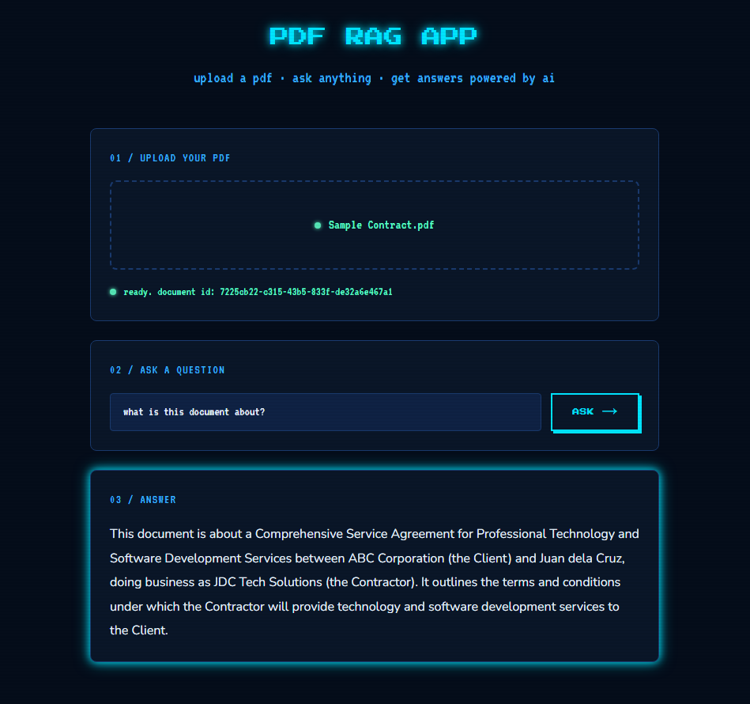

# PDF RAG App

A full-stack AI application that lets users upload a PDF 
and ask questions about it. The app processes the document 
into chunks, converts them into vector embeddings, and uses 
semantic search to find the most relevant content before 
generating an accurate answer.

## Demo


## How it works
1. User uploads a PDF file
2. Backend extracts text and splits it into chunks
3. Each chunk is converted to embeddings and saved to Supabase
4. User asks a question
5. Question is converted to embeddings and matched against chunks
6. Most relevant chunks are sent to Groq AI
7. AI generates an answer based only on the document

## Tech stack
| Layer | Technology |
|---|---|
| Frontend | Next.js, TypeScript, Tailwind CSS |
| Backend | FastAPI, Python |
| AI | Groq API (Llama 3.3 70b) |
| Embeddings | OpenAI-compatible embeddings |
| Database | Supabase + pgvector |
| Deploy | Vercel (frontend), Render (backend) |

## What I learned
- How RAG (Retrieval-Augmented Generation) works end to end
- Why splitting documents into chunks is better than sending 
  the whole document — saves storage and improves AI accuracy
- Why chunk overlap is necessary to prevent important 
  information from being cut off at chunk boundaries
- How vector embeddings represent meaning as numbers and 
  how pgvector searches them using cosine similarity
- How to build a FastAPI backend with file upload handling

## Challenges and solutions
- Understanding vector embeddings and pgvector SQL functions 
  → broke it down step by step, learned that embeddings are 
  just numbers representing meaning and `<=>` measures 
  the distance between them
- Supabase schema permissions → added GRANT statements 
  to expose the schema to the API
- LangChain version breaking changes → updated imports 
  to match the newer package structure

## Future improvements
- Upgrade from Naive RAG to Advanced RAG with query 
  rewriting and reranking for more accurate answers
- Add support for multiple PDF uploads per session
- Add streaming responses for faster user experience
- Add source citations showing which part of the PDF 
  the answer came from

## Local setup

### Backend
```bash
cd backend
python -m venv venv
venv\Scripts\activate
pip install -r requirements.txt
uvicorn main:app --reload
```

### Frontend
```bash
cd frontend
npm install
npm run dev
```

## Environment variables
Create a `.env` file in the root folder:
```bash
SUPABASE_URL=your_supabase_url_here
SUPABASE_KEY=your_supabase_key_here
GROQ_API_KEY=your_groq_key_here
```

## Author
Shana Cruzat 
